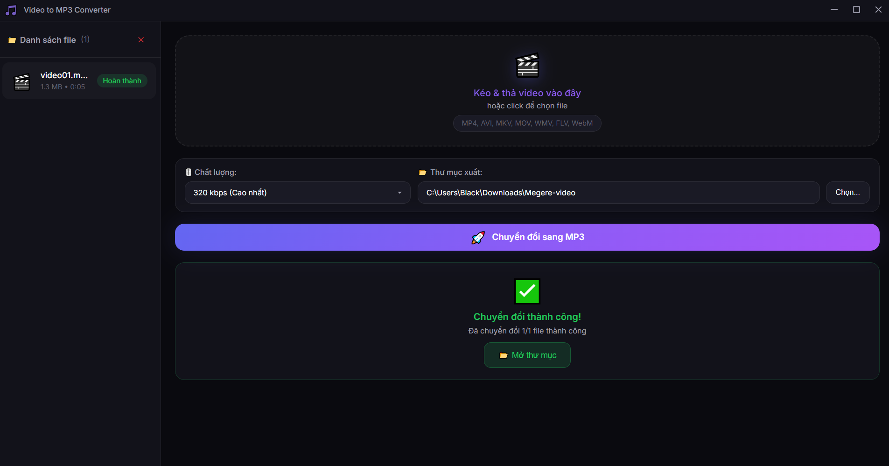

# 🎵 Video to MP3 Converter

Một ứng dụng desktop hiện đại, đẹp mắt giúp chuyển đổi video sang định dạng MP3 với chất lượng cao. Được xây dựng bằng **Electron**, giao diện **Glassmorphism** và tối ưu hóa trải nghiệm người dùng.


*(Bạn hãy thêm ảnh chụp màn hình vào thư mục assets/screenshot.png)*

## ✨ Tính Năng Chính

- **🎯 Drag & Drop**: Kéo thả video trực tiếp vào ứng dụng để xử lý nhanh chóng.
- **⚡ Chuyển đổi hàng loạt**: Hỗ trợ chuyển đổi nhiều video cùng lúc.
- **🎚️ Tùy chọn chất lượng**:
  - 320 kbps (Cao nhất)
  - 256 kbps (Cao)
  - 192 kbps (Trung bình)
  - 128 kbps (Thấp)
- **🎨 Giao diện hiện đại**: Thiết kế Dark Theme với hiệu ứng Glassmorphism và sidebar tiện lợi.
- **📱 Responsive**: Giao diện tự động thích ứng với kích thước cửa sổ.
- **📁 Hỗ trợ đa dạng**: MP4, AVI, MKV, MOV, WMV, FLV, WebM, M4V, 3GP.

## 🛠️ Cài Đặt & Chạy Local

### Yêu cầu
- [Node.js](https://nodejs.org/) (Khuyên dùng bản LTS)
- Git

### Các bước thực hiện

1. **Clone dự án**
   ```bash
   git clone https://github.com/username/video-to-mp3.git
   cd video-to-mp3
   ```

2. **Cài đặt dependencies**
   ```bash
   npm install
   ```

3. **Chạy ứng dụng (Chế độ Dev)**
   ```bash
   npm run dev
   # hoặc
   npm start
   ```

## 📦 Đóng Gói (Build)

Để tạo file cài đặt (`.exe` cho Windows):

```bash
npm run build
```
File cài đặt sẽ nằm trong thư mục `dist/`.

## 🔧 Công Nghệ Sử Dụng

- **[Electron](https://www.electronjs.org/)**: Framework phát triển ứng dụng desktop.
- **[FFmpeg](https://ffmpeg.org/)**: Xử lý và chuyển đổi định dạng âm thanh/video.
- **Google Fonts (Inter)**: Typography hiện đại.
- **HTML5 & CSS3**: Giao diện người dùng tùy biến cao.

## 🤝 Đóng Góp

Mọi đóng góp đều được hoan nghênh! Hãy tạo Pull Request hoặc mở Issue nếu bạn tìm thấy lỗi.

## 📄 License

Dự án được phân phối dưới giấy phép **MIT**. Xem file `LICENSE` để biết thêm chi tiết.
